<div align="center">

# Sash

Collect badges and certificates on one profile, claim them from expiring links, and share it as an image or an embed

[![Live][badge-site]][url-site]
[![HTML5][badge-html]][url-html]
[![CSS3][badge-css]][url-css]
[![JavaScript][badge-js]][url-js]
[![Claude Code][badge-claude]][url-claude]
[![License][badge-license]](LICENSE)

[badge-site]:    https://img.shields.io/badge/live_site-0063e5?style=for-the-badge&logo=googlechrome&logoColor=white
[badge-html]:    https://img.shields.io/badge/HTML5-E34F26?style=for-the-badge&logo=html5&logoColor=white
[badge-css]:     https://img.shields.io/badge/CSS3-1572B6?style=for-the-badge&logo=css3&logoColor=white
[badge-js]:      https://img.shields.io/badge/JavaScript-F7DF1E?style=for-the-badge&logo=javascript&logoColor=black
[badge-claude]:  https://img.shields.io/badge/Claude_Code-CC785C?style=for-the-badge&logo=anthropic&logoColor=white
[badge-license]: https://img.shields.io/badge/license-MIT-404040?style=for-the-badge

[url-site]:   https://sash.neorgon.com/
[url-html]:   #
[url-css]:    #
[url-js]:     #
[url-claude]: https://claude.ai/code

</div>

---

## Overview

Sash is where a Neorgon badge lands. Somebody designs one in
[Enamel](https://enamel.neorgon.com/), hands out a claim link, and the person
who redeems it gets a credential on a page they control: they pin the ones they
want seen first, hide the ones they do not, and share the wall as a PNG or an
iframe.

Every badge is drawn with the handle that issued it, the wall it belongs to and
the address that verifies it printed into the artwork, so a badge saved as an
image still says where it came from. These are community badges. They are not a
professional qualification and nobody accredits them, which the site says on
every page rather than in a footnote.

**Live:** sash.neorgon.com

---

## Features

- **One wall, four groups** -- Neorgon badges the site grants, community badges
  grouped by what they are for, recognition other people send, and credentials
  imported from elsewhere.
- **Choose what to show** -- pin up to 24 badges into a showcase, order them,
  and hide anything you would rather not display.
- **A public profile** -- `u.html?h=<handle>` reads without an account.
- **One Neorgon account** -- sign-in is the fleet's Auth Kit, so the account you
  use on any other `*.neorgon.com` site opens this wallet too.
- **Stacked recognition** -- a badge sent twice counts twice instead of
  appearing twice.
- **Imports stay imports** -- a credential from another issuer is listed as its
  issuer sent it, linked to the source, and never redrawn as a Sash badge.
- **PNG export** -- the whole wall or one group, with the fonts embedded so the
  picture matches the page.
- **An embeddable wall** -- one iframe snippet, no account, no tracking.

---

## Running locally

ES modules require an HTTP server (not `file://`):

```bash
make serve            # http://localhost:8884
```

The backend is Convex and lives in `convex/`. Enamel has no `convex/` folder
and calls this same deployment, so every backend command runs from this folder
and nowhere else. See `convex/README.md`.

```bash
npm install
npx convex dev          # push convex/ to your dev deployment and keep it in step
npm test                # enum, rate-limit and seed-idempotence checks
```

**Sign-in is the Neorgon Auth Kit** (`js/neorgon-auth.js`, vendored from
`packages/neorgon-ui/auth/`): one account for every `*.neorgon.com` site, with
the header slot and the sign-in dialog owned by the kit rather than by this
site. The key is the fleet's production Clerk instance, and Clerk refuses a
production key on any origin but `neorgon.com`, so on a local server every page
settles into its signed-out state and the dialog says why. The pages that read
without an account (`u.html`, `badge.html`, `embed.html`, `policy.html`, and the
preview on `claim.html`) work locally; anything that writes needs the deployed
site. See Gotchas in `CLAUDE.md`.

---

## Architecture



One Convex deployment, two origins. `sash.neorgon.com` and
`enamel.neorgon.com` call the same functions; the deployment lives in this
repo's `convex/` because Sash is the system of record, and its URL is a
`<meta name="neo-convex-url">` on every page of both sites. Sign-in is the
Neorgon Auth Kit and the award art is the Insignia Kit, both vendored from
`packages/neorgon-ui/` and never edited here.

```
sash-site/
├── index.html          # My wallet: awards, pin, hide, reorder, profile, handle
├── u.html              # Public profile, readable with no account
├── badge.html          # Verify one award
├── claim.html          # Redeem a claim link
├── embed.html          # The iframe widget: no sign-in, no storage, no tracking
├── import.html         # Import a credential from elsewhere
├── send.html           # Send recognition
├── policy.html         # What a Sash badge is, and is not
├── 404.html
├── css/
│   ├── style.css       # Site styles. Tokens come from the CDN base.css
│   ├── public.css      # badge.html and claim.html
│   ├── forms.css       # import.html, send.html and policy.html
│   ├── embed.css       # The widget, on its own
│   ├── frame.css       # The framed-page notice
│   └── neorgon-*.css   # Vendored kits: header, themes, footer, beacon, insignia, auth
├── js/
│   ├── app.js          # Entry point for index.html and u.html, dispatches on body[data-page]
│   ├── state.js        # Shared state, Convex calls, the Auth Kit session
│   ├── render.js       # The profile head, the groups, the showcase
│   ├── events.js       # Every listener on index.html and u.html
│   ├── wallet.js       # index.html page wiring
│   ├── profile.js      # u.html page wiring
│   ├── badge.js        # badge.html, its own entry module
│   ├── claim.js        # claim.html
│   ├── embed.js        # embed.html
│   ├── import.js       # import.html
│   ├── send.js         # send.html
│   ├── frame.js        # The framed-page notice; policy.html and 404.html load only this
│   ├── utils.js        # The badge-specific helpers, plus `el` and `$`
│   ├── convex.js       # The function-name map (owned by the backend)
│   ├── neorgon-auth.js # The Auth Kit: header slot, sign-in dialog, Convex token
│   ├── neorgon-*.js    # The other vendored kits: header, footer, DOM, avatar, beacon
│   └── insignia/       # The Insignia Kit: renderer, exporter, Open Badges codec, award grid
├── convex/             # The backend. Enamel calls this deployment too
├── ob/                 # Static Open Badges issuer documents; keys/1.json is the signing key's public half
├── docs/
│   └── architecture.svg
└── Makefile
```

### Backend

```
convex/
├── schema.ts           # Seven tables; templateVersions is immutable once written
├── profiles.ts         # Handle, profile, showcase, hidden awards
├── templates.ts        # Enamel's designs and their metadata
├── versions.ts         # Frozen versions; every award pins one
├── claims.ts           # Claim links: create, preview, redeem, revoke, claimants
├── awards.ts           # What a wallet and a public profile read
├── kudos.ts            # Stackable recognition
├── imports.ts          # Credentials from other issuers; importFetch.ts does the fetch in Node
├── art.ts              # Uploaded artwork, and the daily orphan sweep crons.ts schedules
├── ob.ts               # Open Badges export, signed with OB_SIGNING_KEY
├── rate.ts             # One sliding-window limiter for every bucket
├── seed.ts             # ensureNeorgonTemplates, the only writer of origin "neorgon"
├── data/               # The Neorgon catalogue and the real-issuer blocklist
├── lib/                # Validators, limits, shapers, grants
└── tests/              # npm test, plain node; contract-shapes needs a live deployment
```

`convex/README.md` has the per-file table, the amendments the folder carries and
its own gotchas.

---

<div align="center">
<sub>Part of <a href="https://neorgon.com/">Neorgon</a></sub>
</div>
